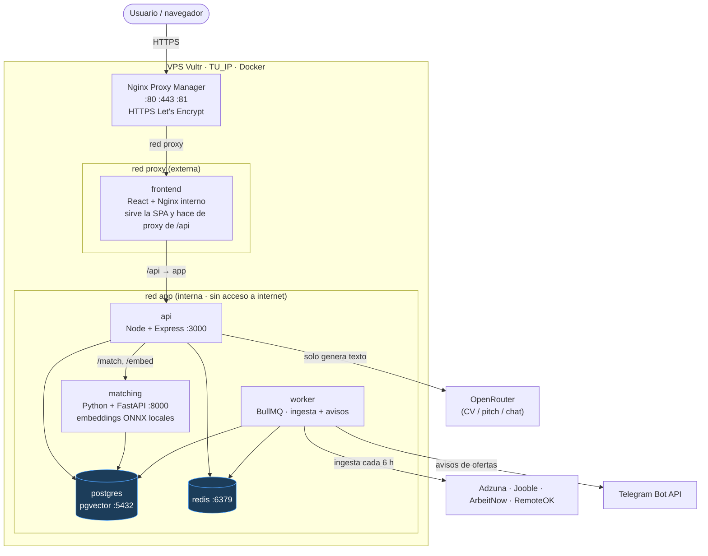
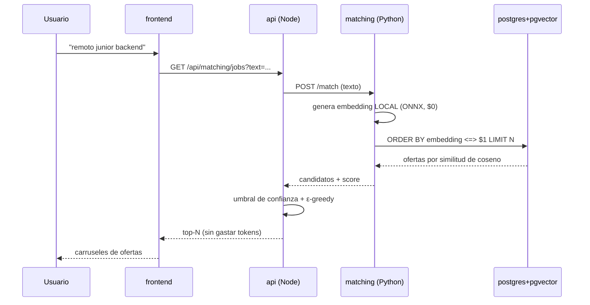
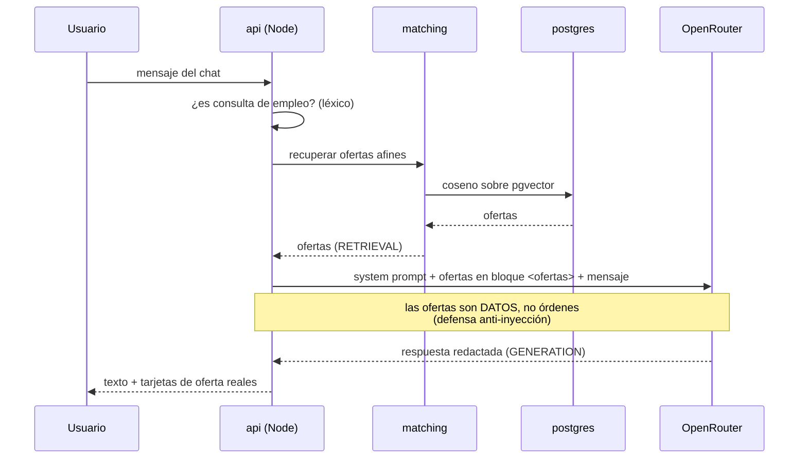

# Jobia — Diagrama de despliegue

Arquitectura real en producción: `https://jobia.duckdns.org` (`TU_IP`),
VPS Vultr de 2 vCPU · 4 GB, todo en Docker.

---

## Vista general (Mermaid)

> Se renderiza automáticamente en GitHub/GitLab. Si lo ves como texto, mira el
> diagrama ASCII más abajo.



---

## Flujo de una búsqueda de ofertas (sin IA generativa)



**Clave:** todo el matching es matemático y local. **No se llama a ningún LLM.**

---

## Flujo del chat (RAG, sí usa LLM)



---

## Diagrama ASCII (respaldo)

```
                          Internet
                             │  :80  :443
                             ▼
                 ┌───────────────────────────┐
                 │   Nginx Proxy Manager     │  panel :81
                 │   HTTPS + Let's Encrypt   │  (jobia.duckdns.org)
                 └───────────┬───────────────┘
                             │   red "proxy" (externa)
                             ▼
                      ┌────────────┐
                      │  frontend  │  React + Nginx interno.
                      │            │  Sirve la SPA y hace de proxy de /api
                      └─────┬──────┘
                            │   red "app" (interna, invisible a internet)
             ┌──────────────┼───────────┬──────────────┐
             ▼              ▼           ▼              ▼
       ┌──────────┐  ┌────────────┐ ┌────────┐  ┌──────────┐
       │   api    │  │  matching  │ │ redis  │  │ postgres │
       │ Node:3000│  │ FastAPI    │ │        │  │ pgvector │
       └────┬─────┘  │ ONNX local │ └────────┘  └──────────┘
            │        └────────────┘
            ▼
       ┌──────────┐   El worker es el único que sale a internet:
       │  worker  │──▶ Adzuna · Jooble · ArbeitNow · RemoteOK  (ingesta 6 h)
       │  BullMQ  │──▶ OpenRouter                              (CV/pitch/chat)
       └────┬─────┘──▶ Telegram Bot API                        (avisos)
            └─▶ postgres · redis
```

---

## Tabla de contenedores

| Servicio | Imagen | Puerto interno | Red | Expuesto a internet |
|---|---|---|---|---|
| `nginx-proxy-manager` | jc21/nginx-proxy-manager | 80/443/81 | proxy | **Sí** (único) |
| `frontend` | node build → nginx:alpine | 80 | proxy + app | No (vía NPM) |
| `api` | node:20 | 3000 | app | No |
| `matching` | python:3.11 + ONNX | 8000 | app | No |
| `postgres` | pgvector/pgvector:pg16 | 5432 | app | No |
| `redis` | redis:alpine | 6379 | app | No |
| `worker` | node:20 | — | app | No |

**Solo NPM publica puertos.** Todo lo demás vive en la red interna `app`.

---

## Dónde vive cada coste

| Pieza | Dónde corre | Coste |
|---|---|---|
| Voz → texto (dictado) | Navegador (Web Speech API) | $0 |
| Texto → embedding | `matching` (ONNX local) | $0 |
| Ofertas afines (coseno) | `postgres` + pgvector | $0 |
| CV / pitch / chat | OpenRouter (LLM `:free`) | céntimos / racionado |

El **matching nunca gasta tokens**. Solo la generación de texto toca OpenRouter.
